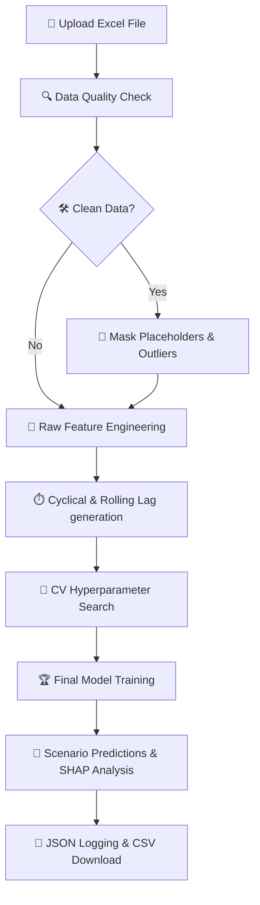

# 🌊 OmniSim AI — Lake Simulation TimeSeries v1.0

[](https://www.python.org/)
[](https://streamlit.io/)
[](https://xgboost.readthedocs.io/)
[](https://shap.readthedocs.io/)
[](https://github.com/noybiss)

> **OmniSim AI** is a state-of-the-art Environmental Simulation Engine. Specifically engineered for environmental scientists, limnologists, and researchers, it provides a universal time-series simulation engine to predict scenarios with high density and academic-grade precision.

---

## 🚀 Key Features

*   **⚡ Automated Machine Learning Pipeline**: Just upload your raw Excel file! The engine automatically parses historical records, aligns indices, runs target detection, and constructs features.
*   **🔍 Advanced Data Quality Auditing**: Scans data on-the-fly to discover missing placeholder values (e.g., `-999`, `-9999`) and statistical outliers using robust **Interquartile Range (IQR)** filtering.
*   **🧠 High-Performance Modeling**: Powered by **XGBoost** with automated **Time-Series Cross-Validation (TimeSeriesSplit)** hyperparameter optimization to prevent training leakages.
*   **🔮 SHAP Explainability (XAI)**: Demystifies the machine learning "black box" by calculating exact game-theory-based SHAP values, identifying which parameters drove the simulation outcomes.
*   **🌙 Scientific Dark Mode UI**: A gorgeous, custom dark-themed UI styled with modern fonts (*Inter* and *Space Grotesk*) to reduce eye strain during prolonged analytical work.
*   **📁 Structured Run Logging**: Automatically serializes accuracy metrics ($R^2$, RMSE), model parameters, and top SHAP drivers into JSON files for future AI analysis.

---

## 🛠️ How It Works (Step-by-Step Workflow)



1.  **Upload File 📂**: Drop your `.xls` or `.xlsx` workbook. The system reads **Sheet 1** as history and **Sheets 2+** as scenario conditions.
2.  **Audit Data 🔍**: Review detected missing placeholders and outliers. Choose to clean specific columns or proceed with raw values.
3.  **Optimize 🚀**: Watch the model tune itself! The app displays a live "racing line chart" showing cross-validated $R^2$ improvement over search iterations.
4.  **Analyze 📊**: Explore interactive Plotly projections comparing history with predictions, backed by horizontal SHAP feature impact rankings.
5.  **Export ⬇️**: Download prediction outcomes formatted as standardized CSVs for German locales (`;` delimiter, `,` decimals).

---

## ⚙️ Under The Hood (ML Pipeline Details)

### 1. Cyclical Time Representations ⏰
Standard integers represent months (1–12) or hours (0–23) poorly, making December (12) and January (1) seem far apart. OmniSim AI projects dates onto a unit circle:
$$\text{month\_sin} = \sin\left(\frac{2\pi \cdot \text{month}}{12}\right), \quad \text{month\_cos} = \cos\left(\frac{2\pi \cdot \text{month}}{12}\right)$$

### 2. Temporal Smoothing & Lags 📉
The system automatically calculates 3-day and 7-day rolling statistics of all predictors, feeding essential temporal trends into the regression trees.

### 3. Hyperparameter Tuning 🎛️
During training, a Time-Series Split cross-validation optimizes the learning rate, maximum tree depth, and estimator size to ensure high generalization scores.

---

## 📂 Project Directory Structure

```text
├── app.py                     # 🌐 Main Streamlit Application & UI Layer
├── run.command                # ⚡ One-click macOS/Linux Shell Launcher
├── requirements.txt           # 📦 Python Package Dependencies
├── .gitignore                 # 🚫 Git Exclude Patterns (filters large sheets)
├── modules/                   # 🧠 Core Backend Architecture
│   ├── __init__.py            # 📦 Module Package Setup
│   ├── data_loader.py         # 🗄️ Excel Ingestion & IQR Outlier Checks
│   ├── feature_engineering.py  # 🧬 Sine/Cosine Cyclicals & Rolling Lags
│   ├── model.py               # 🌲 XGBoost Trainer Wrapper
│   ├── explainer.py           # 🔮 SHAP TreeExplainer Logic
│   ├── visualizer.py          # 🎨 Plotly Custom Dark-Theme Templates
│   └── logger.py              # 📝 Serialized JSON Run Logging
└── docs/                      # 📖 Deep Academic Documentation
    ├── Design.md              # 📐 UI/UX Design System Layout
    ├── Specification.md       # 📋 Detailed Project Specifications
    ├── documentation_de.md    # 🇩🇪 Comprehensive German Academic Docs
    ├── explanation_de.md      # 🇩🇪 Quick German User Explanation
    └── explanation_fa.md      # 🇮🇷 Quick Persian User Explanation
```

---

## 💻 Installation & Quick Start

### 1. Clone the repository
```bash
git clone https://github.com/noybiss/lake-simulation-timeseries.git
cd lake-simulation-timeseries
```

### 🐳 Option A: Run with Docker (Recommended & Easiest)
You can run OmniSim AI containerized without installing Python, compilers, or packages locally.

#### Using Docker Compose
1. **Build and launch the container**:
   ```bash
   docker compose up --build
   ```
2. **Access the application**:
   Open your browser at [http://localhost:8501](http://localhost:8501) ⚡
   *(Any logs created during runs will automatically sync to your local `./logs/` directory)*

#### Using Standard Docker Commands
1. **Build the image**:
   ```bash
   docker build -t omnisim-ai .
   ```
2. **Run the container**:
   ```bash
   docker run -d -p 8501:8501 -v "$(pwd)/logs:/app/logs" --name omnisim-instance omnisim-ai
   ```
3. **Access the application**:
   Open your browser at [http://localhost:8501](http://localhost:8501) ⚡

---

### 🐍 Option B: Local Development Setup

#### Prerequisites
Make sure you have **Python 3.9+** installed. If you are using macOS, it is recommended to install `libomp` (required by XGBoost for multi-threading):
```bash
brew install libomp
```

#### Setup Steps
1. **Install dependencies**:
   ```bash
   pip install -r requirements.txt
   ```

2. **Run the Streamlit Dashboard**:
   ```bash
   streamlit run app.py --server.port 8502
   ```
   *On macOS, you can also double-click `run.command` directly from the Finder to launch.*

---

## 📊 File Formatting Guidelines

To get accurate simulations, structure your Excel workbook as follows:

*   **Sheet 1 (Historical data)**:
    *   Must contain a chronological index column named `Time`, `Date`, `Datetime`, `Timestamp`, `Datum`, or `Zeit`.
    *   All other columns must contain numeric values (e.g., `temperature`, `oxygen`, `ph`, `precipitation`).
*   **Sheets 2+ (Scenarios)**:
    *   Must have the **exact same columns** as Sheet 1.
    *   Exactly **one** column must be left **entirely empty (NaN)**. This is the variable the AI will automatically identify as the target and predict for you.

---

**Developed & Maintained by [OA](https://github.com/noybiss)**  
*Universal Environmental Intelligence Engine.*
